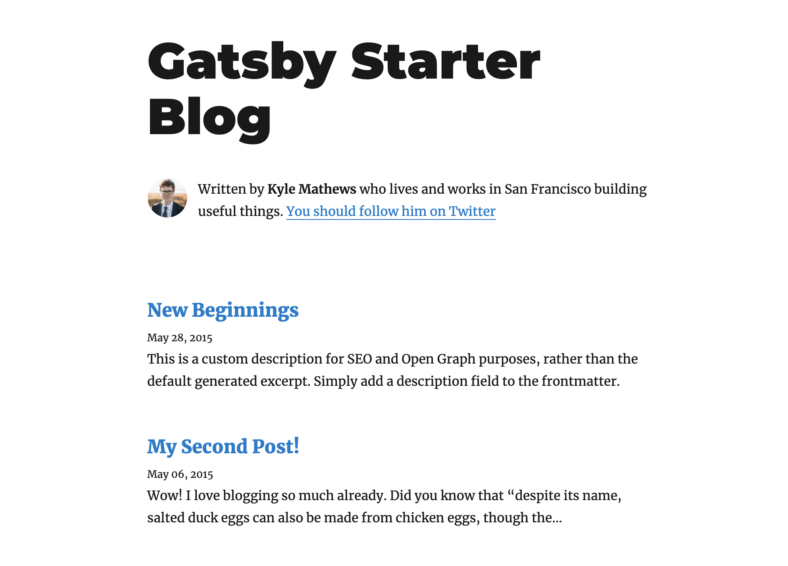
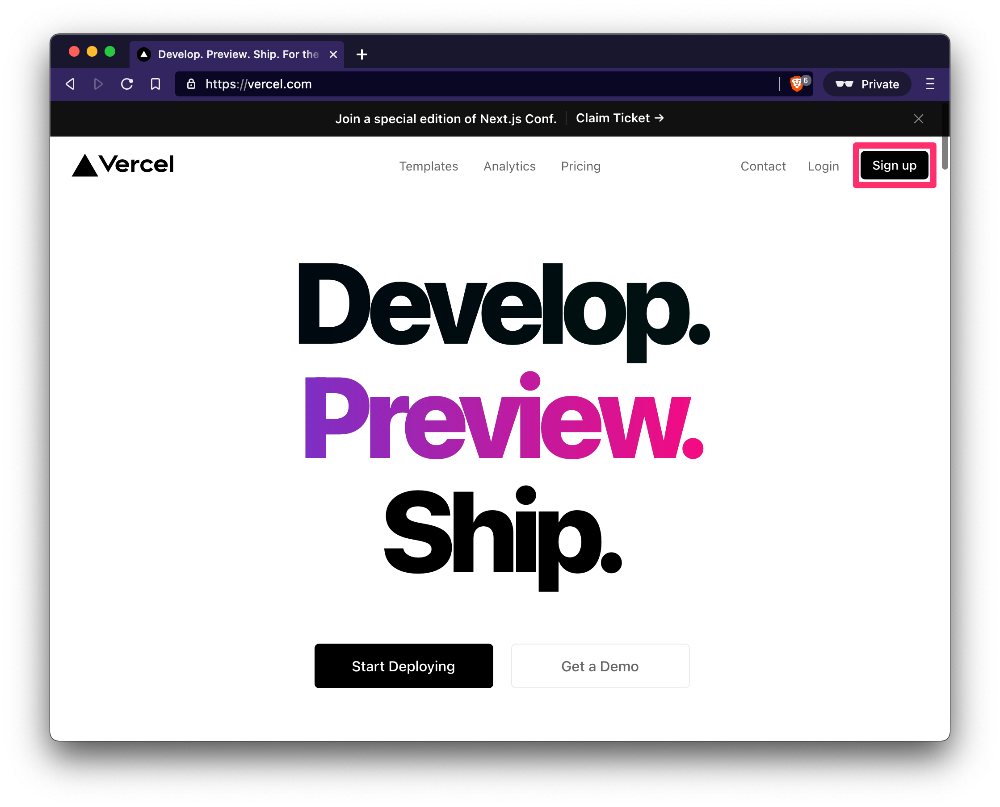
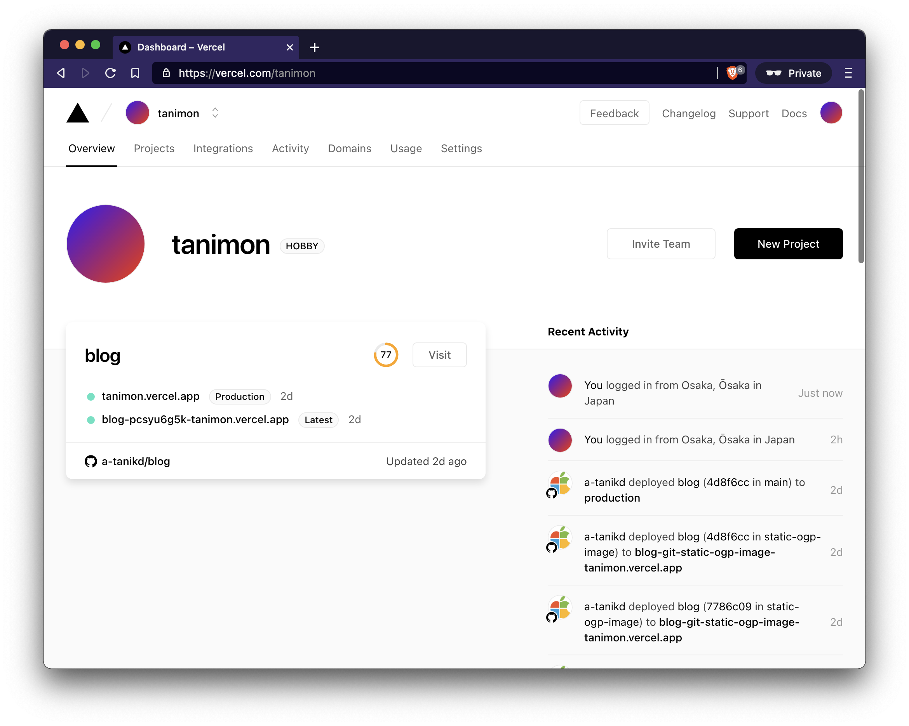
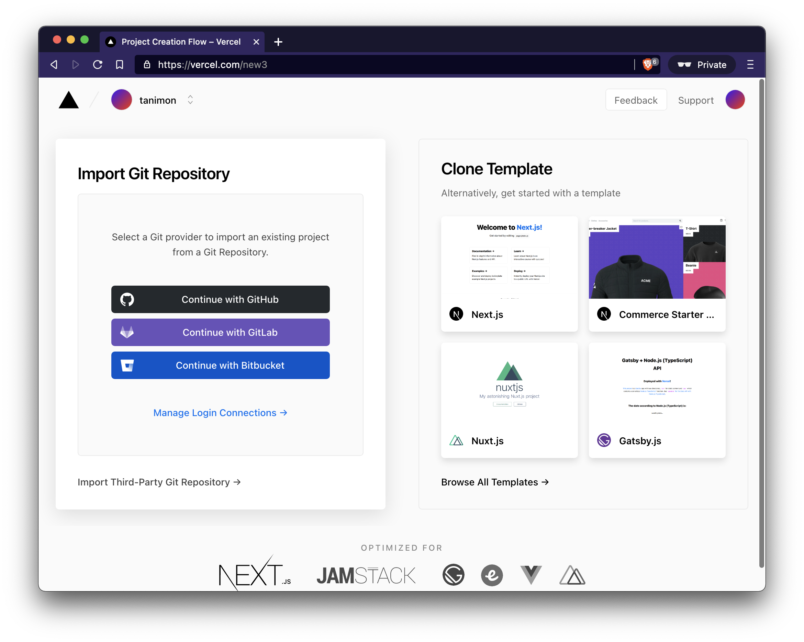
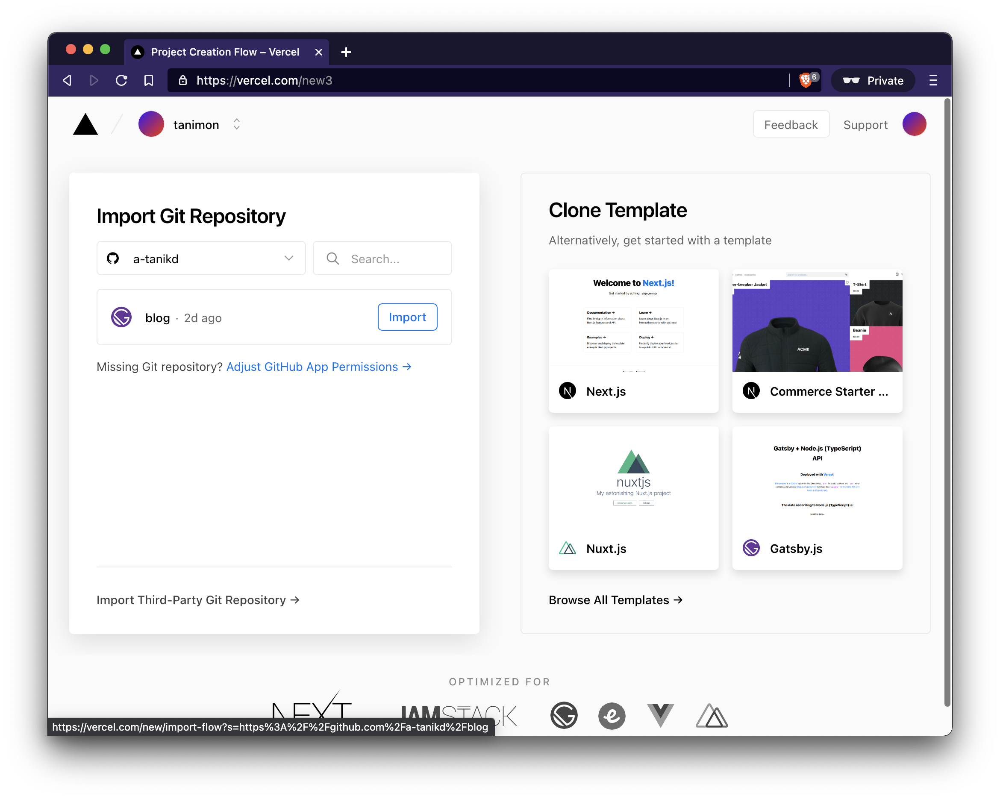
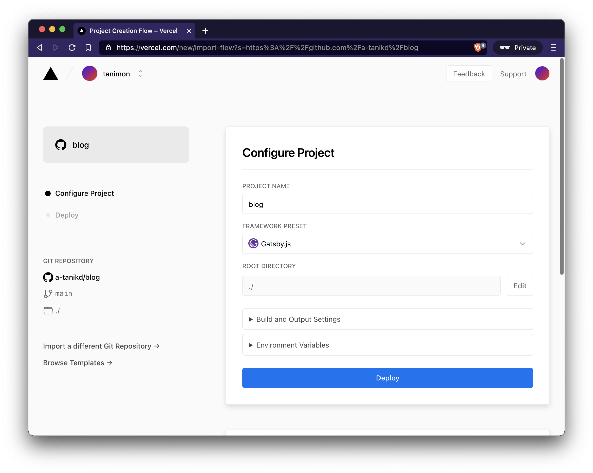
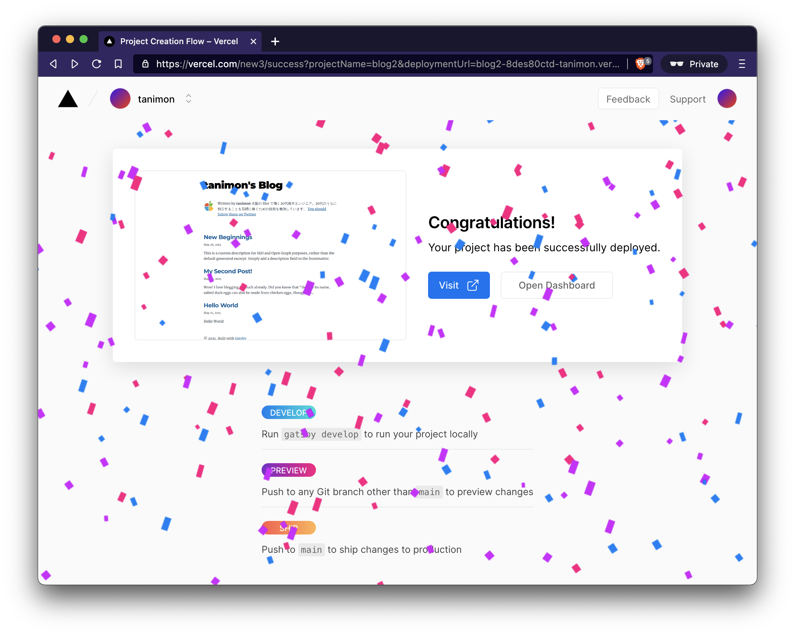

[Qiita](https://qiita.com/) とか [Zenn](https://zenn.dev/) とかエンジニア向けの記事投稿サイトはあるけど、自分のブログもほしい！ 😆  
[はてなブログ](https://hatenablog.com/) とかの無料ブログプラットフォームもあるけど、エンジニアなんだからどうせだったら自分で作ってみたい！ 😎  
でも、Web 系の知識そんなにない 😂  
それと、はじめのうちはお金かけたくない！ 🤑

こんなふうに考えているエンジニアも少なからずいることでしょう。  
かく言う私もその 1 人です 😇  
そんな私が手探りしながら、TypeScript + Gatsby + Vercel という技術スタックを用いて完全無料でこのブログを構築したので、その方法を解説します！
調べながら理解したことも解説していくのでお役に立てれば幸いです！

ちなみに、このブログは[このリポジトリ](https://github.com/tanimon/blog)で開発しているため、具体的な実装を確認したい方はご参照ください。

# 前提

本題の前に、いくつか前提事項を説明します。

## 私の技術的背景

まずは、私の技術的背景について触れておきたいと思います。
私は大学で情報系を専攻していたこともあり、プログラミング経験はある程度あり、
複数のプログラミング言語を日常使いできる程度の知識はありました。  
また、Git や GitHub を用いたバージョン管理や、git-flow や GitHub Flow などの
Pull Request ベースのチーム開発も問題なく行える状態でした。

ただ、Web 系技術に関していえば次のような感じでした。

- JavaScript の文法はだいたい知ってて、[MDN Web Docs](https://developer.mozilla.org/ja/docs/Web)とかのドキュメント見ながらだったら問題なくコーディングできると思う。多分
- TypeScript は軽く触ったことがある程度で、JavaScript の静的型付けバージョンぐらいの認識
- JS / TS のエコシステムはよく分からない。`npm` とか `yarn` とかあるけどどう違うの？
- [React][react] は[チュートリアル](https://ja.reactjs.org/tutorial/tutorial.html)を一通りやって、基本は理解している
- [Gatsby][gatsby] は React 製の SSG (Static Site Generator) ぐらいの認識
- ホスティングサービスとしては [Vercel][vercel] や
  [Netlify](https://www.netlify.com/)、[GitHub Pages](https://pages.github.com/)
  、[CloudFlare Pages](https://pages.cloudflare.com/) など色々あるみたいだけど、それぞれの特徴とか違いとかよく分からない

以上のとおり、「プログラミングはできるけど、Web 系技術よく分からん 😇」という状態でした。  
この程度の技術力でも調べながら数日でブログを開設できたので、同じような状況の方の参考になれば嬉しいです！

## 環境

今回は以下の環境でブログを構築しました。

- OS: macOS Big Sur 11.2.3
- Node.js: ver. 16.2.0
- Yarn: ver. 1.22.10
- npm: ver. 7.13.0

# ブログ開設までの大まかな流れ

ここから、ようやく本題です！  
今回は次のような流れでブログを構築しました！

1. [`gatsby-starter-blog`](https://www.gatsbyjs.com/starters/gatsbyjs/gatsby-starter-blog) のプロジェクト作成
1. 1.で作ったプロジェクトをおもむろに Vercel にデプロイ
1. テンプレート部分を自分の情報に置き換える
1. プロジェクト全体を JavaScript から TypeScript に書き換える

以降では、それぞれについて解説していきます！

# Gatsby プロジェクトの作成

## Gatsby とは？

このブログは [Gatsby][gatsby] というフレームワークを用いて構築されています。  
Gatsby を一言で説明すると、[React][react] で書かれた SSG (Static Site Generator; 静的サイトジェネレータ)です。
SSG とは名前のとおり、静的なサイトを作成してくれるフレームワークのことです。  
Gatsby は単なる React 製の SSG というだけではなく、REST API や GraphQL を用いてデータを簡単に引っ張ってこれたり、
パフォーマンスが高まるように自動で最適化をかけてくれたりもします。  
Gatsby のメリットについてもっと詳しく知りたい方は[このページ](https://www.gatsbyjs.com/why-gatsby/)が参考になると思います。

まあひとまず、 Gatsby はイケてる React 製の SSG ぐらいの認識で大丈夫です 😆

## Gatsby のインストール

まずは Gatsby のインストールを行いましょう！  
以下のコマンドを実行すれば Gatsby のインストールが完了します！

```sh
$ npm install -g gatsby-cli
```

これで、`gatsby` コマンドが使えるようになりました！  
以下のコマンドで、`gatsby` コマンドが正しくインストールされたことを確認しましょう。
インストールできていれば、以下のようにバージョン情報が出力されます。

```sh
$ gatsby -v
Gatsby CLI version: 3.6.0
```

## プロジェクト作成

次に、Gatsby プロジェクトを作成しましょう！  
以下のコマンドを実行することで、`<project-dir>` で指定したディレクトリの中に Gatsby プロジェクトが作成されます。

```sh
$ gatsby new <project-dir> https://github.com/gatsbyjs/gatsby-starter-blog
```

Gatsby には Starter と呼ばれる、プロジェクトのテンプレートのようなものが多数存在します。  
Starter の一覧は[ここ](https://www.gatsbyjs.com/starters/?)で見られます。

今回は [gatsby-starter-blog](https://www.gatsbyjs.com/starters/gatsbyjs/gatsby-starter-blog/) という、
ブログ向けの Starter を利用しています。  
この Starter のソースコードが `https://github.com/gatsbyjs/gatsby-starter-blog` で管理されていて、
この URL を `gatsby new` コマンドの引数に与えてあげることで、この Starter をもとにプロジェクトを作成できます。

## プロジェクトをビルドしてローカルで動かしてみる

`gatsby new` コマンドで作成されたプロジェクトは、基本的な要素はそろっていて、すでに Web ブラウザから確認できる状態になっています。  
ということで、プロジェクトをビルドして、ローカル環境で動かしてみましょう！

```sh
$ gatsby develop
# ...略
You can now view gatsby-starter-blog in the browser.

  http://localhost:8000/

View GraphiQL, an in-browser IDE, to explore your site's data and schema

  http://localhost:8000/___graphql

Note that the development build is not optimized.
To create a production build, use gatsby build

success Building development bundle - 9.170s
```

上記のように `success Building development bundle` というメッセージが出力されたらビルド成功です！  
途中エラーが表示されるかもしれませんが、それは見なかったことにしましょう 😝

これで、出力されたメッセージにあるように、 http://localhost:8000/ にアクセスすれば、以下の画像のようなページが表示されるはずです！ 🎉



ちゃんと動くことが確認できたら、GitHub や GitLab, BitBucket などの Git ホスティングサービスに push しておきましょう。  
上記 3 つのホスティングサービスであれば、この後の Vercel でのデプロイが簡単になります。

# プロジェクトを Vercel にデプロイ

## Vercel とは？

[公式ドキュメント](https://vercel.com/docs)によると、Vercel は以下のように説明されています。

> Vercel is a deployment and collaboration platform for frontend developers. Vercel puts the frontend developer first, giving them comprehensive tools to build high-performance websites and applications.
>
> Vercel enables developers to host websites and web services that deploy instantly and scale automatically – all without any configuration.

つまり、フロントエンド開発者の使い心地を優先して作られた Web サイトや Web アプリをデプロイできるサービスのことです。  
しかも、高パフォーマンスな Web サイト/アプリを作るためのツールも充実していたり、設定なしでオートスケールしてくれたりするみたいですね。

要は、簡単に Web サイトをインターネット上に公開するための環境のことです 😆

## Vercel のアカウント作成

Vercel について、なんとなく理解したところで、早速アカウントを作ってみましょう！
まずは [Vercel][vercel] にアクセスし、右上の **"Sign up"** ボタンからアカウントを作りましょう。



## プロジェクトをインポート

アカウントが作成できたら、次のようなダッシュボード画面が表示されると思います。



この画面で、右上の **"New Project"** ボタンをクリックします。  
すると、以下のようにプロジェクトをインポートするための画面が表示されます。



ここで、先程 Gatsby プロジェクトを push した Git ホスティングサービスのボタンをクリックします。  
すると、アカウント連携の画面が立ち上がり、連携を完了すると、次のようなリポジトリを選択する画面が表示されます。



ここで、目当てのリポジトリの **"Import"** ボタンをクリックします。  
すると、プロジェクト設定画面が表示されます。設定はデフォルトのままで **"Deploy"** ボタンをクリックすれば OK です。



すると、Vercel がリポジトリからソースコードを引っ張ってきて、ビルドからデプロイまで自動で行ってくれます。  
ビルドには 1〜2 分程度かかると思うので、ワクワクしながら少し待ちましょう。  
ビルドが完了すると、以下のような画面が表示され、デプロイ完了です！



真ん中の **"Visit"** ボタンをクリックすると、実際にビルドされたサイトにアクセスできます。  
おめでとうございます！ これであながた作成したブログがインターネット上に公開されました！ 🎉

# テンプレート情報を自分の情報に置き換える

めでたく、ブログをインターネット上に公開できましたが、ここで 1 つ問題があります。  
そう、このままだとあなたのブログではなく、Kyle Mathews さんのブログになってしまっています。

そこで、しっかりあなたのブログであることが分かるように情報を書き換えていきましょう。  
タイトル下の自己紹介文の情報はプロジェクトルートの `gatsby-config.js` ファイルで管理されています。

```js
module.exports = {
  siteMetadata: {
    title: `Gatsby Starter Blog`,
    author: {
      name: `Kyle Mathews`,
      summary: `who lives and works in San Francisco building useful things.`,
    },
    description: `A starter blog demonstrating what Gatsby can do.`,
    siteUrl: `https://gatsbystarterblogsource.gatsbyjs.io/`,
    social: {
      twitter: `kylemathews`,
    },
  },
  // ...略
```

このファイルの `siteMetadata` の中身をあなたの情報で上書きしましょう！  
そうすれば、ビルド結果のサイトも更新されているはずです！  
ちなみに、`gatsby develop` コマンドを実行すると、プロジェクト内のファイルが更新される度に、
自動的にリビルドされるため、変更内容をすぐに確認できます。  
いやあ、Gatsby さまさまですね。笑

内容が更新されているのを確認できたら、リモートリポジトリに push しておきましょう。
すると、今度は Vercel がリポジトリへの push を自動で検知し、新たなソースコードに対してビルド → デプロイを自動で行ってくれます！  
いやあ、Vercel さまさまですね。笑

# プロジェクト全体を TypeScript 化

無事、あなたのブログをインターネット上に公開できたところで、今後のブログの開発をしやすくするために TypeScript を導入しましょう。  
早速 TypeScript の導入の仕方を解説していきましょう！

…と言いたいところですが、TypeScript の導入ではいくつか詰まったポイントがあり、
それらに関して詳しく解説したいのですが、そうすると記事が長くなりすぎてしまうため
TypeScript 化に関しては次の記事で解説したいと思います。  
次の記事更新までしばらくお待ちください 🙇‍♂️

# まとめ

今回の記事では、ブログ開設のために必要な次の手順を順番に説明しました。

1. Gatsby のインストール
1. Gatsby プロジェクトの作成
1. Vercel アカウントの作成
1. Vercel への Gatsby プロジェクトのデプロイ
1. テンプレートの内容の書き換え

次回の記事では、今回解説しきれなかったプロジェクトの TypeScript 化について説明する予定です。

[gatsby]: https://www.gatsbyjs.com/
[react]: https://ja.reactjs.org/
[vercel]: https://vercel.com/
